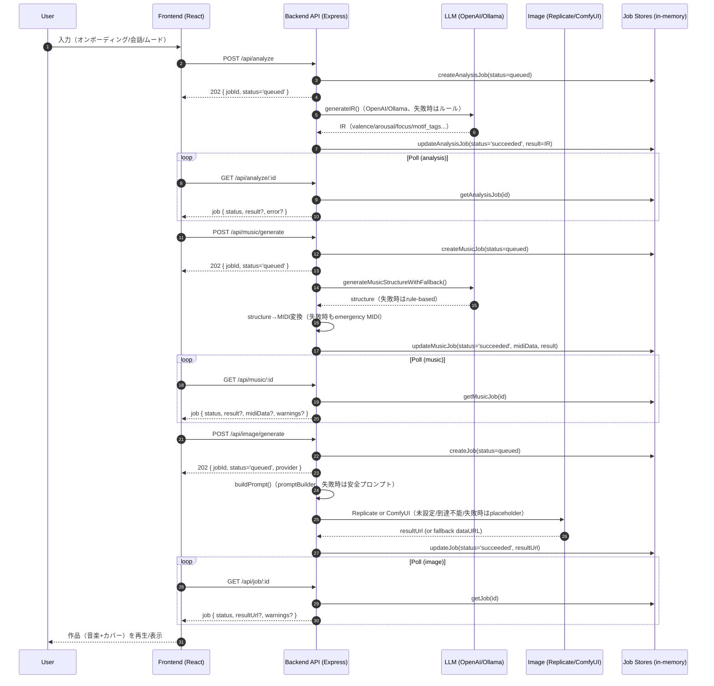

# システム構成（AIRIA-BEYOND）

このドキュメントは、AIRIA-BEYOND の **全体構成図**（デプロイ構成＋主要データフロー）と、図を補完する説明文をまとめたものです。

---

## 1) 全体構成図（デプロイ／実行環境）

```mermaid
flowchart LR
  user[User Browser]
  subgraph FE[Frontend: Static Hosting]
    fe[React + Vite (TypeScript)]
  end
  subgraph API[Backend API: Node.js/Express]
    api[Express Server (server.js)]
    routes[API Routes (/api/*)]
    analyze["Analyze<br/>POST /api/analyze<br/>GET /api/analyze/:id"]
    music["Music<br/>POST /api/music/generate<br/>GET /api/music/:id<br/>POST /api/music/preview"]
    image["Image<br/>POST /api/image/generate<br/>GET /api/job/:id"]
    auth["Auth<br/>/api/auth/*"]
    diag["Diagnostics/Admin<br/>/api/diagnostics/*<br/>/api/admin/*"]
    subgraph Stores[In-Memory Stores (prototype)]
      analysisStore[(analysisJobStore: Map, 1h expiry)]
      musicStore[(musicJobStore: Map, 1h cleanup)]
      imageStore[(jobStore: Map, 1h expiry)]
      limiter["rate-limit: Map<br/>rate + concurrency"]
    end
    prompt[Prompt Builder (promptBuilder.js)]
  end
  subgraph Providers[External / Local Providers]
    openai["OpenAI Chat Completions<br/>(analysis/music)"]
    ollama["Ollama /api/chat<br/>(analysis/music)"]
    replicate["Replicate SDXL<br/>(image)"]
    comfy["ComfyUI<br/>(/prompt,/history,/view)"]
    itunes["iTunes Search API<br/>(music preview)"]
  end
  subgraph Data[Persistence]
    authFile["Auth Store JSON<br/>api/data/auth-store.json<br/>or AUTH_STORE_PATH"]
    authDb["Postgres (optional)<br/>DATABASE_URL"]
    audit["Audit Log JSON<br/>api/data/audit-log.json<br/>or AUDIT_LOG_PATH"]
  end
  user -->|HTTPS| fe
  fe -->|CORS + JSON| routes
  api --> routes
  routes --> analyze
  routes --> music
  routes --> image
  routes --> auth
  routes --> diag
  analyze --> analysisStore
  music --> musicStore
  image --> imageStore
  analyze --> limiter
  music --> limiter
  image --> limiter
  image --> prompt
  analyze --> openai
  analyze --> ollama
  music --> openai
  music --> ollama
  image --> replicate
  image --> comfy
  music --> itunes
  auth -.-> authFile
  auth -.-> authDb
  diag -.-> audit
  classDef dim fill:#f7f7f7,stroke:#bbb,color:#333;
  class FE,API,Providers,Data dim;
```

### 補足（図の読み方）

- **フロントエンド**は静的配信（例: GitHub Pages / Netlify 等）を前提に、UI と状態遷移を担います。
- **バックエンドAPI**（Node.js/Express）が生成・認証・ジョブ状態を集約して扱うため、フロントは「ボタン → API → 進捗表示」という役割分担になります。
- **バックエンドAPI**（Node.js/Express）が「分析・生成・認証・ジョブ状態」を集約して扱うため、フロントは「開始 → ポーリングで進捗表示 → 完了表示」に専念できます。
- **ジョブストア（analysis/music/image）は現状すべてインメモリ**です（プロトタイプ）。そのため API 再起動でジョブが消え、一定時間で自動削除されます。
- **プロバイダは差し替え可能**で、未設定・到達不能・失敗時のフォールバック（LLM は rule-based、画像は placeholder）を実装しています。

---

## 2) 生成フロー図（refine → music → image）



### 補足（設計上のねらい）

- **ジョブ方式（作成→ポーリング）**にすることで、生成に時間がかかっても UI が固まりにくく、通信断や再読み込みにも復帰しやすい構造になります。
- 生成が失敗しても「何も表示できない」を避けるため、**分析はルール／画像はプレースホルダー**などのフォールバックを前提にしています。
- 現状の job store はインメモリのため、**API再起動でジョブが消える**点が制約です（ロードマップで永続化を検討する余地）。

---

## 3) 可用性・運用のポイント（図を補完する説明）

### フォールバック設計（体験を止めない）

- LLM キーが未設定の場合でも、分析や整形は **ルールベース**で代替し、体験が進むようにします。
- 画像プロバイダが未設定の場合でも、placeholder で「作品の見た目」を最低限成立させます。

### strict-provider（本番相当の検証）

- strict-provider は **スモークテスト（開発/運用検証用スクリプト）側**で提供されています。
  API 自体は「体験を止めない」方針のため、基本的にフォールバックして成功扱いに寄せる実装になっています。

### CORS / 公開URL（静的フロント＋API分離の要点）

- フロントとAPIが別オリジンになるため、API側は CORS を **許可Originのみに限定**します。
- 環境変数 `APP_PUBLIC_URL` / `APP_ALLOWED_ORIGINS` で、GitHub Pages／カスタムドメイン等の差分を吸収します。

### 現状の永続化（どこまで保存される？）

- 認証（ユーザー/セッション）: `AUTH_STORE_PATH` の JSON か、`DATABASE_URL` があれば Postgres に保存
- 監査ログ: `api/data/audit-log.json`（`AUDIT_LOG_PATH` で変更可能）に保存（SSE配信もあり）
- 生成ジョブ（analysis/music/image）: **インメモリのみ**で一定時間後に削除（再起動で消える）

---

## 4) プレゼン用・一言まとめ（読み上げ用）

- 「フロントは静的、重い処理はAPIに集約。APIがジョブと生成を握り、プロバイダは差し替え可能。キーが無くてもフォールバックで体験は止めない」
