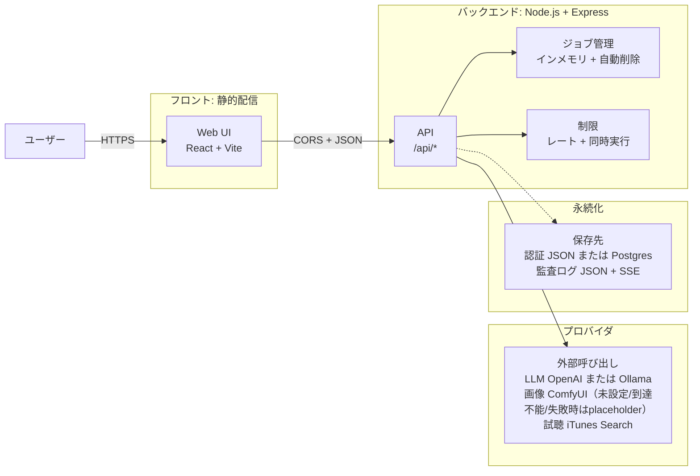
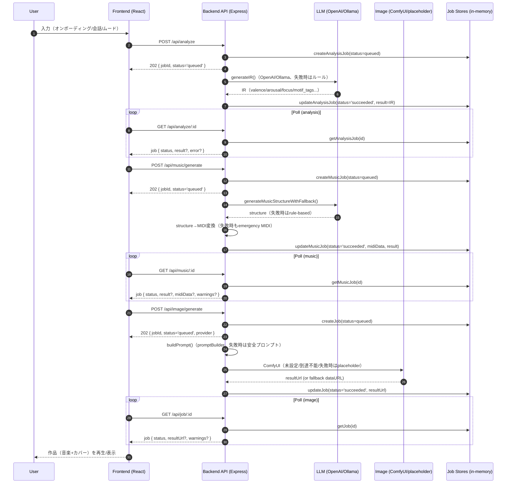

# システム構成（AIRIA-BEYOND）

このドキュメントは、AIRIA-BEYOND の **全体構成図**（デプロイ構成＋主要データフロー）と、図を補完する説明文をまとめたものです。

---

## 1) 全体構成図（デプロイ／実行環境）

### 補足（図の読み方）

- この図は「詳細なエンドポイントを全部描く」のではなく、**責務のまとまり**で俯瞰するためにコンパクト化しています。
- **フロント: 静的配信**
  - UI と状態遷移を担当します（ホスティングは GitHub Pages / Netlify 等を想定）。
  - API とは CORS を前提に JSON で通信します。
- **バックエンド: Node.js + Express**
  - `/api/*` 配下で、分析・音楽・画像・認証・運用系の入口をまとめて受けます。
  - **ジョブ管理**は現状インメモリのため、API再起動でジョブが消え、一定時間後に自動削除されます。
  - **制限**（レートと同時実行）で、連打や過負荷時の破綻を抑えます。
- **プロバイダ**
  - LLM（OpenAI / Ollama）、画像生成（ComfyUI）、試聴取得（iTunes Search）などの外部呼び出しをまとめています。
  - 未設定・到達不能・失敗時はフォールバックして、体験が止まらないようにしています。
- **永続化**
  - 認証ストア（JSON または Postgres）と監査ログ（JSON + SSE）が対象です。
  - 生成ジョブ自体は現状永続化していません（プロトタイプ仕様）。

---

## 2) 生成フロー図（refine → music → image）

### 補足（設計上のねらい）

- **ジョブ方式（作成→ポーリング）**にすることで、生成に時間がかかっても UI が固まりにくく、通信断や再読み込みにも復帰しやすい構造になります。
- 生成が失敗しても「何も表示できない」を避けるため、**分析はルール／画像はプレースホルダー**などのフォールバックを前提にしています。
- 現状の job store はインメモリのため、**API再起動でジョブが消える**点が制約です（ロードマップで永続化を検討する余地）。

---

## 3) 可用性・運用のポイント（図を補完する説明）

### フォールバック設計（体験を止めない）

- LLM キーが未設定の場合でも、分析や整形は **ルールベース**で代替し、体験が進むようにします。
- 画像プロバイダが未設定の場合でも、placeholder で「作品の見た目」を最低限成立させます。

### strict-provider（本番相当の検証）

- strict-provider は **スモークテスト（開発/運用検証用スクリプト）側**で提供されています。
  API 自体は「体験を止めない」方針のため、基本的にフォールバックして成功扱いに寄せる実装になっています。

### CORS / 公開URL（静的フロント＋API分離の要点）

- フロントとAPIが別オリジンになるため、API側は CORS を **許可Originのみに限定**します。
- 環境変数 `APP_PUBLIC_URL` / `APP_ALLOWED_ORIGINS` で、GitHub Pages／カスタムドメイン等の差分を吸収します。

### 現状の永続化（どこまで保存される？）

- 認証（ユーザー/セッション）: `AUTH_STORE_PATH` の JSON か、`DATABASE_URL` があれば Postgres に保存
- 監査ログ: `api/data/audit-log.json`（`AUDIT_LOG_PATH` で変更可能）に保存（SSE配信もあり）
- 生成ジョブ（analysis/music/image）: **インメモリのみ**で一定時間後に削除（再起動で消える）

---

## 4) 工夫点（設計・実装で意識したこと）

- **体験を止めないフォールバック**
  - LLM や画像プロバイダのキー未設定、外部サービスの不調でも「何も出ない」を避ける設計です。
- **ジョブ方式でUIを軽くする**
  - 生成はジョブ化してポーリングで状態取得するため、長時間処理でも画面が固まりにくく、通信断からも復帰しやすい構造です。
- **プロバイダ差し替え可能な境界**
  - LLM はローカル（Ollama）と外部（OpenAI）を選べ、画像は ComfyUI を前提にしています（未設定/到達不能時は placeholder へフォールバック）。
- **過負荷対策を最初から入れる**
  - レート制限と同時実行制限で、1ユーザーの連打や想定外のトラフィックでも落ちにくい前提を作っています。
- **運用に必要なログ導線**
  - 監査ログの保存と（必要に応じた）SSE配信により、動いている状態を追えるようにしています。

---

## 5) 今後の展望（ロードマップの方向性）

- **ジョブの永続化とキュー化**
  - インメモリジョブを DB へ移し、必要ならワーカー + キューで非同期実行へ（再起動耐性、スケール、再実行が改善）。
- **プロバイダの健全性チェックと自動切替**
  - 事前ヘルスチェック、失敗率を見たフェイルオーバー、段階的フォールバックで安定性を上げる。
- **観測性の強化**
  - メトリクス、トレース、エラー集約を追加して、原因特定と改善サイクルを早くする。
- **生成品質の改善**
  - プロンプトと中間表現の改善、評価用ゴールデンケースの拡充、モデル別の最適化。
- **プロダクト面の強化**
  - アルバム履歴、共有、権限、ストレージ戦略（生成物の保管）など、作品としての体験を厚くする。

---

## 6) プレゼン用・一言まとめ（読み上げ用）

- 「フロントは静的、重い処理はAPIに集約。APIがジョブと生成を握り、プロバイダは差し替え可能。キーが無くてもフォールバックで体験は止めない」
