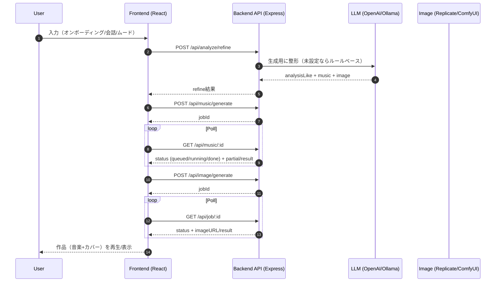

# システム構成（AIRIA-BEYOND）

このドキュメントは、AIRIA-BEYOND の **全体構成図**（デプロイ構成＋主要データフロー）と、図を補完する説明文をまとめたものです。

---

## 1) 全体構成図（デプロイ／実行環境）

```mermaid
flowchart LR
  user[User Browser]

  subgraph FE[Frontend: Static Hosting]
    fe[React + Vite (TypeScript)]
  end

  subgraph API[Backend API: Node.js/Express]
    api[Express Server (/api/*)]
    auth[Auth + Session]
    jobs[Job Store (music/image/analyze)]
    refine[Refine / Prompt Builder]
  end

  subgraph Providers[External / Local Providers]
    llm[LLM: OpenAI or Ollama\n(fallback: rule-based)]
    img[Image: Replicate or ComfyUI\n(fallback: placeholder)]
  end

  subgraph Data[Persistence]
    json[(JSON Store: pre-release)]
    pg[(Postgres: DATABASE_URL)]
    disk[(Render Disk: AUTH_STORE_PATH)]
  end

  user -->|HTTPS| fe
  fe -->|CORS + JSON| api

  api --> auth
  api --> jobs
  api --> refine

  refine -->|prompt/params| llm
  jobs -->|generate/poll| llm
  jobs -->|generate/poll| img

  auth -.-> json
  auth -.-> disk
  auth -.-> pg

  jobs -.-> pg

  classDef dim fill:#f7f7f7,stroke:#bbb,color:#333;
  class FE,API,Providers,Data dim;
```

### 補足（図の読み方）

- **フロントエンド**は静的配信（例: GitHub Pages / Netlify 等）を前提に、UI と状態遷移を担います。
- **バックエンドAPI**（Node.js/Express）が生成・認証・ジョブ状態を集約して扱うため、フロントは「ボタン → API → 進捗表示」という役割分担になります。
- **プロバイダは差し替え可能**で、未設定時のフォールバック（LLM は rule-based、画像は placeholder 等）を備えています。

---

## 2) 生成フロー図（refine → music → image）



### 補足（設計上のねらい）

- **ジョブ方式（作成→ポーリング）**にすることで、生成に時間がかかっても UI が固まりにくく、通信断や再読み込みにも復帰しやすい構造になります。
- 生成が失敗しても「何も表示できない」を避けるため、**フォールバックを前提**に設計しています。

---

## 3) 可用性・運用のポイント（図を補完する説明）

### フォールバック設計（体験を止めない）

- LLM キーが未設定の場合でも、分析や整形は **ルールベース**で代替し、体験が進むようにします。
- 画像プロバイダが未設定の場合でも、placeholder で「作品の見た目」を最低限成立させます。

### strict-provider（本番相当の検証）

- 実際の運用では「外部プロバイダを本当に使えているか」を確実にしたい場面があるため、
  **strict モード**でフォールバックを禁止して検証できる運用が想定されています。

### CORS / 公開URL（静的フロント＋API分離の要点）

- フロントとAPIが別オリジンになるため、API側は CORS を **許可Originのみに限定**します。
- 環境変数 `APP_PUBLIC_URL` / `APP_ALLOWED_ORIGINS` で、GitHub Pages／カスタムドメイン等の差分を吸収します。

---

## 4) プレゼン用・一言まとめ（読み上げ用）

- 「フロントは静的、重い処理はAPIに集約。APIがジョブと生成を握り、プロバイダは差し替え可能。キーが無くてもフォールバックで体験は止めない」
